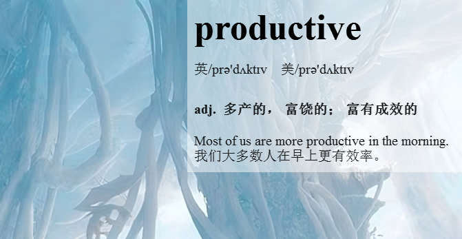
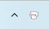
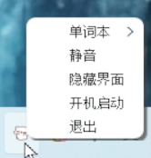
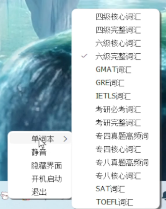

  

# EngLishCorner
#### 在Windows桌面轮播单词、学习单词

### 基本功能
#### 每隔1分钟刷新一个单词到界面上展示，刷新的同时会朗读一遍英文发音。

### 基本用法

#### 1. 启动
双击`english_corner.exe`启动本程序。

#### 2. 界面
启动程序后，程序窗口默认在桌面右上角展示。

#### 3. 托盘

在任务栏会展示托盘图标。

右击展示托盘菜单。

**开机启动**: windows开机后自动运行本程序，默认为关闭状态。

**隐藏界面**: 关闭界面展示。

**静音**: 关闭声音。

**单词本**：选择要展示/学习的单词。

### 其他用法&说明
1. 界面隐藏情况下，双击托盘图标立即展示界面。
2. 设置选项均会保存在本地，下次启动使用上次的配置。

### 操作系统要求
建议使用Windows 11操作系统

### 开发
本项目使用QT6.8版本，使用Qt Creator(C++) 14开发。